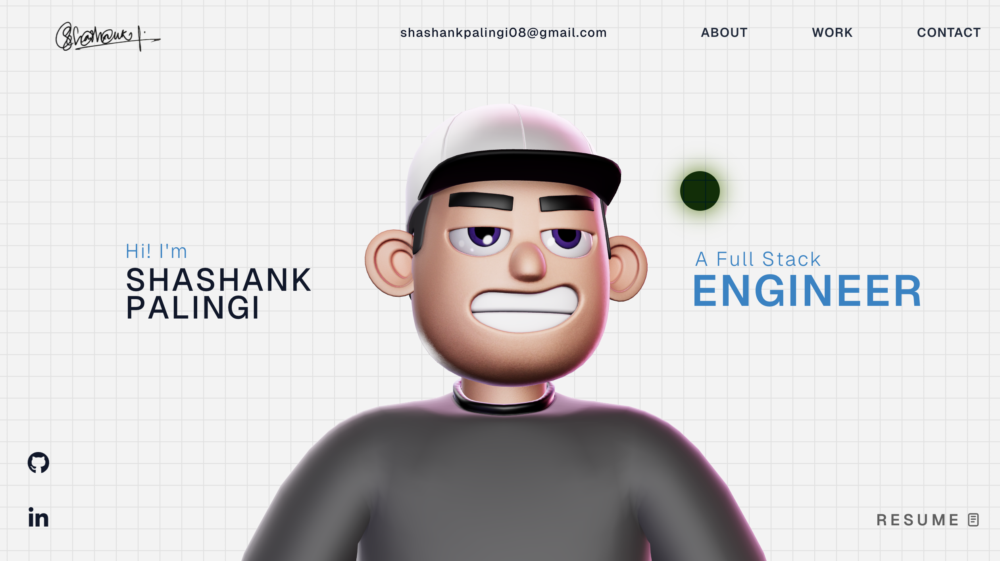

# 🚀 Shashank Palingi's 3D Interactive Portfolio

A modern, high-performance developer portfolio built with React, Three.js, and GSAP.



## ✨ Key Features

- **3D Graphics & Models:** Built with Three.js and React Three Fiber.
- **Advanced Animations:** Powered by GSAP.
- **Responsive Design:** Fully responsive layout.
- **Modern Build:** Powered by Vite.

## 🛠️ Tech Stack

- **Framework:** React 18
- **Language:** TypeScript
- **3D Rendering:** Three.js, @react-three/fiber, @react-three/drei
- **Animations:** GSAP
- **Styling:** CSS3
- **Bundler:** Vite

## 🚀 Getting Started

1. **Install dependencies:**
   ```bash
   npm install
   ```

2. **Run the development server:**
   ```bash
   npm run dev
   ```
